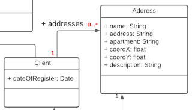
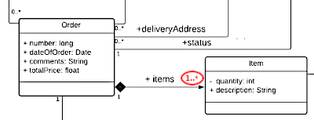
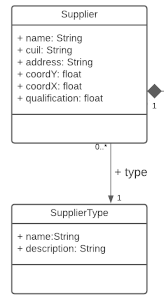

# Trabajo Práctico Final

**DISEÑO DE BASES DE DATOS - MG IS 2021**

###INFORME TRABAJO PRÁCTICO FINAL###

MAYO 2022

####*Docentes:*

Mg. Javier Bazzocco

Lic.Federico Di Claudio

####*Alumnos:*

Blas Cenzano Dragún

Martin Cesar Urbieta

{Grupo 8}

### PARTE 1 - JPA

En esta primera parte, se ha implementado la solución JPA, junto con el desarrollo del código del modelo, el cual fue sujeto a análisis por parte del grupo.
En la segunda parte, se tratará la implementación en DBMongo.

####Análisis de Diagrama de clases
En el diagrama faltaba la cardinalidad entre las clases Client y Address, como se explica en el enunciado.
La relación Client

A criterio del grupo, se entiende que la **relación Order-Item** debe ser de **1 a 1-***, en lugar de 0-* como se propone, para **evitar tener órdenes vacías sin items.**

A criterio del grupo, la **relación Producto-Supplier** debe ser de **0..* a 1**, en lugar de **0..* a 0..*** como se propone en el diseño UML, ajustándolo al enunciado del problema que indica: “…Cada producto es exclusivo de un proveedor…”, verificándose una relación de muchos a 1 y no como la diseñada originalmente. Cada producto es administrado por un sólo proveedor.

La **relación Supplier-SupplierType** debe ser de **0..* a 1**, en lugar de 0..* a 0..* como se propone en el diseño UML, el enunciado del problema indica: “…, cada proveedor posee un tipo (SupplierType)…”, siendo una relación de muchos a 1 ya que cada proveedor es solo de un tipo (restaurant, heladería, quiosco, etc).

####Desarrollo del modelo.

Considerando que la propuesta de aplicación del TP FINAL responde a una variante del API REST delivery trabajado como ejercicio adicional en clase[^1], se evaluó en primera instancia, analizar y seleccionar el código apto para REFACTORING e implementación en el trabajo final.
Se destaca que la clase **DeliveryRoot** fue eliminada, y fueron agregadas al modelo las siguientes clases:

Address: que tomó atributos de coordX y coordY que formaban parte de Order.
-Item
-Qualification
-Product
-HistoricalProductPrice
-ProductType
-Supplier
-SupplierType

A su vez, se procedió a realizar un REFACTORING	 del Controller.

En los casos que un método o atributo del API REST trabajado en clase no figure en el modelo, se mantendrá implementado, salvo que contradiga las especificaciones del TP FINAL.

Se ha generado diagrama ERD (Entity–relationship model), como complemento del diagrama UML.

Para definición de nombres de las tablas, se ha optado por utilizar la notación underscore o snake_case en lugar de otras como PascalCase o camelCase, para distinguir  SQL keywords usados en query, principalmente en este último caso. En el modelo se ha optado por la notación camelCase.

En primer lugar, entendemos que se califica la orden, y esta aplica directamente en el supplier, y no se califica cada ítem en particular recibido siendo una única calificación integral. También, entendemos que la orden sólo incluye items de un mismo proveedor/supplier, es decir, el deliveryman no puede tomar dos o más pedidos de distintos suppliers para una misma orden.

Se ha optado por una leve modificación del modelo, con el fin de lograr una solución más fácil y performante, en relación al comportamiento Order - Qualification (e indirectamente Supplier). Atento a la relación 1 a 1 entre Order y Qualification, para SQL se ha optado por no crear una tabla de Qualification, y embeberla en Order, al igual que SUPPLIER (name), ya que Qualification relaciona Order-Supplier de manera 1 a 1. Esto, con el objetivo de minimizar las operaciones de join requeridas para calcular el Score del Supplier.

Si bien se ha procurado mantener la mayor eficiencia del modelo, se ha permitido del desarrollo de algunos endpoints bajo la premisa *Make It Work* susceptible a eventual refactoring en la Parte 2 (DBMONGO).

En relación al STATE, se ha optado por una instanciación de la Clase, en lugar de la propuesta CASE presentada en delivery_bd[^1]. Se consideró que al rechazar por parte del Delivery Man, el estado de orden o pedido del cliente, vuelva a pending volviendose a confirmar la orden para asignar un nuevo repartidor, debido a que mantiene su voluntad de consumir el producto, pero es el delivery man quien no puede ejecutar el envío.

####DASE DE DATOS

La base de datos de producción se encuentra disponible en

[tpfinal_bd.sql.zip](https://github.com/fedediclaudio/tpfinal_bd/files/8690088/tpfinal_bd.sql.zip)

y los curl post

[curlpost+jsons.zip](https://github.com/fedediclaudio/tpfinal_bd/files/8690097/curlpost%2Bjsons.zip)

[^1]: https://github.com/fedediclaudio/delivery_bd notificado por Ideas el 22/10/21

### PARTE 2 - MONGOJPA

En esta segunda parte, se ha implementado la solución Mongo.
Se utilizó Robot 3T para operar las collecciones y Postman para evaluar los endpoints.

####Modificaciones realizadas

Sobre la base del modelo JPA, se realizaron los siguientes cambios, aparte de las configuraciones en _POM_:
- Adecucaión de annotations:
  - **@Document** en reemplazo de **@Entity** / **@Embeddable**
  - **@Field** en reemplazo de **@Columns** , **@Embedded** y los casos Eager
  - **@DBRef** en lugar de las variantes **@OneToMany**, **@ManyToOne** ,**@ManyToMany** para los casos Lazy
  - **@@MongoId** , **@JsonSerialize** y **ObjectID** en lugar de la notación JPA **@Id**
- Adecuación de modelo, repositorios y servicios:
  - El cambio de ID de Long a **ObjectID**, implica los ajustes respectivos a los getters, repositorios y servicios.

####Docker

Instalación docker en Ubuntu
https://www.digitalocean.com/community/tutorials/how-to-install-and-use-docker-on-ubuntu-20-04-es
####Docker Mongo

docker run --name mongo-container -v /home/home/martinurbieta/develp/BaseDatos2021/tpfinal_bd_Mongo/Collections -p 27017:27017 -d mongo:latest
docker images
docker ps
sudo systemctl start mongod

####Generacion de colecciones via Curl
tirar lineas

####Docker compose

tirar lineas

Pendiente
-- parseado de ID en servicios
-- Implementación state
-- Aggregates
-- superclases